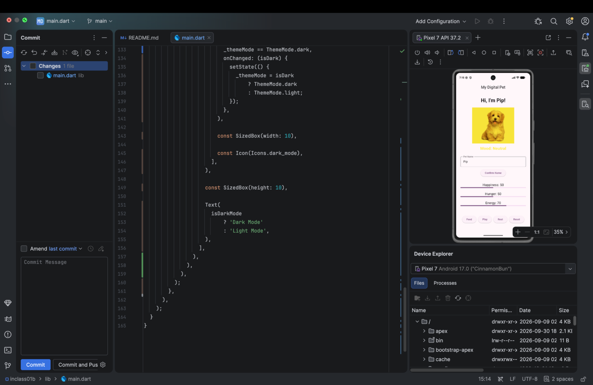
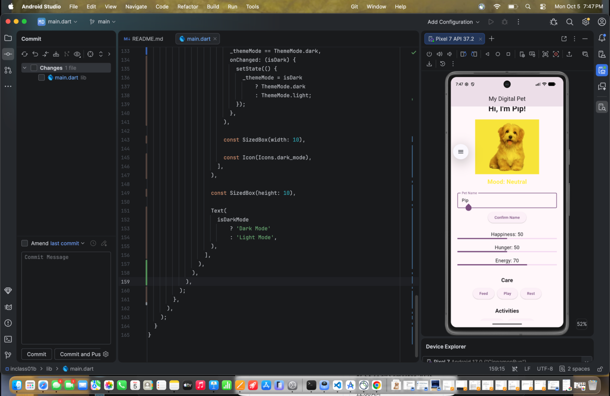
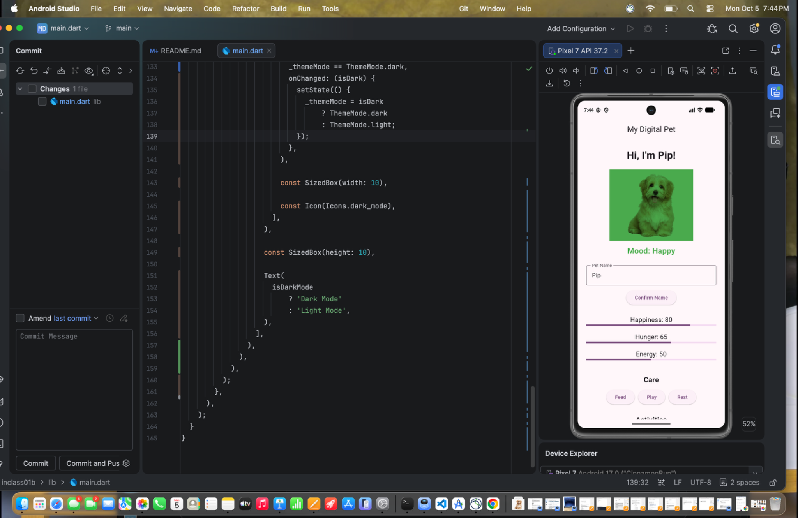
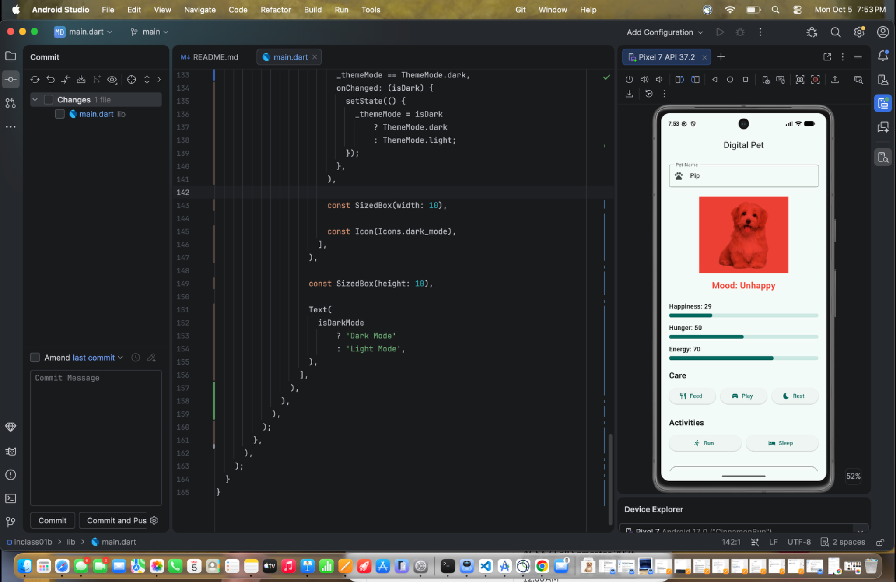

# Digital Pet – In-Class Activity 07

## Team Members

- Maya Cockerham
- Liban Mohamed

## Repository

GitHub Repository:  
https://github.com/mcockerham26/digital_pet_inclass07

## Project Overview

This project is a Digital Pet application created using Flutter and Dart. The app allows the user to take care of a virtual pet by managing its happiness, hunger, and energy.

The pet's mood changes based on its happiness level. The app uses both a written mood label and a color tint so that color is not the only way the pet's mood is communicated.

## Core Features

The Digital Pet app includes:

- Editable pet name
- Happiness meter from 0–100
- Hunger meter from 0–100
- Energy meter from 0–100
- Happy, Neutral, and Unhappy mood states
- ColorFiltered pet image
- Feed action
- Play action
- Rest action
- Run activity
- Sleep activity
- Reset button
- Automatic hunger timer
- Win condition
- Loss condition
- Meter values limited to 0–100
- Timer cleanup when the screen is disposed

## Mood System

The pet's mood is determined by its happiness level:

- Happiness above 70 = Happy / Green
- Happiness from 30–70 = Neutral / Yellow
- Happiness below 30 = Unhappy / Red

The mood is displayed as text along with the color change.

The pet image uses `ColorFiltered` with `BlendMode.modulate` to apply the mood tint.

## Care Actions

### Feed

The Feed button reduces the pet's hunger. If the pet's hunger becomes less than 50 after feeding, its happiness also increases.

### Play

The Play button increases happiness, but it also increases hunger and uses energy.

If the pet does not have enough energy, the app displays a message instead of allowing the pet to play.

### Rest

The Rest button restores energy while slightly increasing hunger.

## Advanced Feature 1 – Energy System

For one of our advanced features, we added an Energy system.

Energy stays between 0 and 100. Playing and running use energy, while resting and sleeping restore energy.

If the pet does not have enough energy to complete an activity, the activity is prevented and the user receives a message.

This adds another value that the user has to manage while taking care of the pet.

## Advanced Feature 2 – Activity Selection

We also added additional activities for the pet.

### Run

Running uses energy and increases hunger, but it also increases happiness.

### Sleep

Sleeping restores a larger amount of energy while slightly increasing hunger.

These activities give the user additional ways to interact with the pet.

## Hunger Timer

The app uses a periodic timer that runs every 30 seconds.

Every 30 seconds, hunger increases by 5 while the game is active.

If hunger is already at 100 when another hunger cycle occurs, hunger stays at 100 and happiness decreases by 20.

The hunger value is kept between 0 and 100.

## Win Condition

The pet's happiness must stay **above 80 continuously for three minutes** to win.

Exactly 80 does not qualify for the win condition.

If happiness drops to 80 or below before the three minutes are complete, the win timer is canceled.

When the win condition is successfully reached, the app displays the winning message and stops the hunger timer.

## Loss Condition

The game is lost when:

- Hunger reaches 100
- Happiness reaches 10 or below

When the loss condition is reached, the game displays a Game Over message.

The care and activity buttons are disabled after a win or loss until the user resets the pet.

## Reset Behavior

The Reset Pet button restores the original pet state:

- Happiness = 50
- Hunger = 50
- Energy = 70
- Pet name = Pip
- Win state = false
- Loss state = false

Reset also cancels the previous timers and starts a new hunger timer so that only one hunger timer is active.

## State Management

The Digital Pet screen uses a `StatefulWidget` because the pet's information changes while the app is running.

The application uses `setState()` when happiness, hunger, energy, or the game outcome changes. This causes Flutter to rebuild the interface and display the new values.

The meter values are clamped between 0 and 100 so they cannot go outside of the allowed range.

The `TextEditingController` used for the pet's name is disposed when the screen is removed.

The hunger and win timers are also canceled in `dispose()` to prevent them from continuing after the screen has been removed.

## Testing

The application was tested for the main interface and state behaviors, including:

- Happiness staying between 0 and 100
- Hunger staying between 0 and 100
- Energy staying between 0 and 100
- Feed button behavior
- Play button behavior
- Rest button behavior
- Run activity
- Sleep activity
- Reset behavior
- Hunger timer behavior
- Win timer logic
- Loss condition logic
- Neutral mood display
- Happy mood display
- Unhappy mood display
- Mood text appearing with the color tint
- Timer cleanup
- Application build and launch

The project was also checked using:

```bash
flutter analyze
```

The final analysis completed with:

```text
No issues found!
```

## App Screenshots

### Main Digital Pet Screen

This screenshot shows the main Digital Pet interface with the pet image, mood, Happiness, Hunger, Energy, care buttons, activities, and reset button.



### Neutral Mood

Happiness between 30 and 70 displays the Neutral mood with a yellow tint.



### Happy Mood

Happiness above 70 displays the Happy mood with a green tint.



### Unhappy Mood

Happiness below 30 displays the Unhappy mood with a red tint.



## Team Contributions

### Maya Cockerham

- Worked on the application interface and layout
- Worked with the Happiness, Hunger, and Energy state values
- Worked on the mood display and pet image
- Worked on care and activity functionality
- Tested and debugged application behavior
- Worked with the GitHub repository and project documentation

### Liban Mohamed

- Collaborated on the Digital Pet project
- Helped develop and review project features
- Helped review state behavior
- Participated in testing and debugging
- Helped review the completed application

## Setup Instructions

Get the Flutter project dependencies:

```bash
flutter pub get
```

Run the application:

```bash
flutter run
```

Check the project for analysis issues:

```bash
flutter analyze
```

Build the Android release APK:

```bash
flutter build apk --release
```

The release APK is generated inside:

```text
build/app/outputs/flutter-apk/app-release.apk
```

## Pet Image Asset

The pet image is stored at:

```text
assets/pet.png
```

The image is registered in `pubspec.yaml` and displayed using `Image.asset()` inside a `ColorFiltered` widget.

**Asset Source/License:** Add the original source and license information for the pet image before final submission.